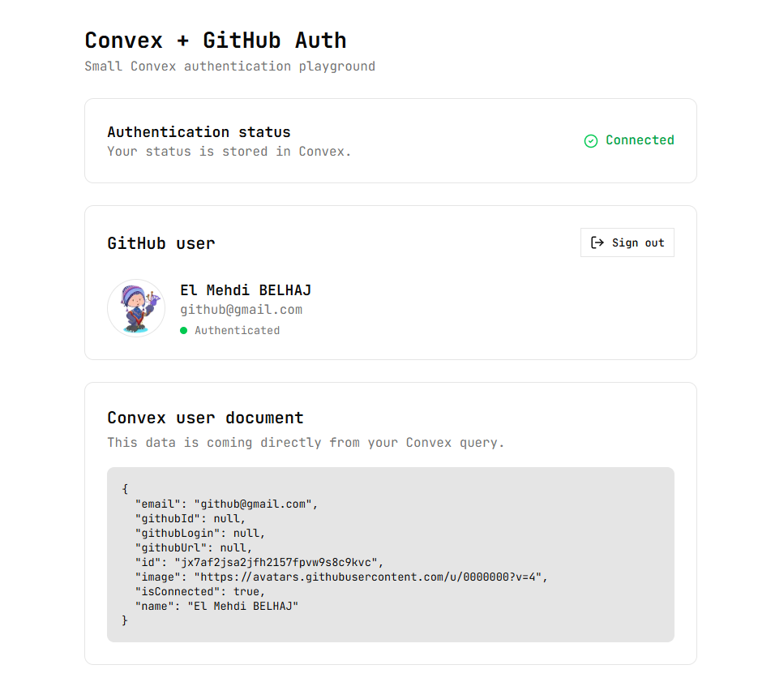

# Convex GitHub Auth

A small Next.js project built to explore GitHub authentication and reactive data with Convex.

## Preview



## Features

- GitHub OAuth authentication with Convex Auth
- Authenticated user data stored in Convex
- Reactive Convex queries
- Connection status stored in the user document
- GitHub avatar, name, and email display
- Sign in / sign out flow
- ESLint and Prettier configuration
- TypeScript

## Tech Stack

- [Next.js](https://nextjs.org/)
- [React](https://react.dev/)
- [TypeScript](https://www.typescriptlang.org/)
- [Convex](https://www.convex.dev/)
- [Convex Auth](https://labs.convex.dev/auth)
- [GitHub OAuth](https://github.com/)
- [Tailwind CSS](https://tailwindcss.com/)
- [shadcn/ui](https://ui.shadcn.com/)
- [Bun](https://bun.sh/)

## How It Works

The application uses Convex Auth to authenticate users with GitHub.

After authentication, the app retrieves the current Convex user and displays their profile information. The connection status is stored directly in the Convex user document and updates the UI reactively.

```text
GitHub
   ↓
Convex Auth
   ↓
Authenticated user
   ↓
Convex users table
   ↓
Reactive Convex query
   ↓
Next.js UI
```

## Getting Started

### 1. Clone the repository

```bash
git clone https://github.com/elmehdibelhaj/convex-github-auth.git
cd convex-github-auth
```

### 2. Install dependencies

Using Bun:

```bash
bun install
```

### 3. Configure environment variables

Create a `.env.local` file:

```env
CONVEX_DEPLOYMENT=
NEXT_PUBLIC_CONVEX_URL=
NEXT_PUBLIC_CONVEX_SITE_URL=
```

Your Convex deployment values can be obtained when setting up the Convex project.

### 4. Start the development server

```bash
bun dev
```

The application will be available at:

```text
http://localhost:3000
```

## Development

Format the project:

```bash
bun format
```

Check formatting:

```bash
bun format:check
```

Run ESLint:

```bash
bun lint
```

Build the application:

```bash
bun run build
```

## Notes

This project is intentionally small and is primarily a learning playground for understanding:

- OAuth authentication
- Convex Auth
- Convex queries and mutations
- Reactive data
- Next.js client components
- TypeScript project configuration

The `isConnected` field represents the application's current authentication state. It is not intended to be a production-grade online-presence system.

## What I Learned

This project helped me understand:

- OAuth authentication with GitHub
- Convex Auth and authenticated identities
- Convex queries and mutations
- Reactive updates in Convex
- Connecting authenticated users to database records
- Managing environment variables safely
- Using ESLint and Prettier in a Next.js project

## License

MIT
